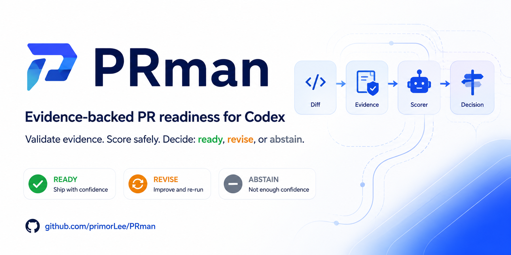

# PRman

PRman is a pre-alpha Codex Skill and Plugin for one complete pull-request workflow:

~~~text
User goal
   |
   v
Read-only GitHub search -> choose one suitable repository and issue
   |
   v
Codex reads the rules -> implements the change -> runs the repository's checks
   |
   v
PRman binds the diff and evidence -> ready / revise / abstain
   |
   v
Exact packet: repository + branches + diff + tests + assessment + PR text
   |
   v
User confirms
   |
   v
Create Draft PR -> follow CI -> make bounded in-scope repairs
~~~

PRman is not another coding model. Codex does the searching, reading, editing, command execution, and
connected GitHub operations. PRman supplies the state machine, quality gate, confirmation boundary,
and safe order of operations. It stores no GitHub token and never auto-merges.

## What a user can ask

~~~text
Use $prman to find an active Python repository with a suitable bug,
implement and test the fix, then ask me before opening a Draft PR.
~~~

PRman searches read-only, selects one contribution-friendly target, checks its AGENTS.md,
CONTRIBUTING, SECURITY, issue state, and CI rules, then lets Codex implement and verify the smallest
useful change. It shows the exact proposed write before any GitHub mutation. A reply such as
“确认” or “yes” is rejected: the user must repeat the displayed target-specific phrase exactly.
For a non-ready assessment, that phrase also names the result being acknowledged.

After confirmation, PRman may create the listed fork or branch, push the assessed commits, create a
Draft PR, and follow CI. It can make up to two directly related CI repairs by default. A new
repository, changed base, changed PR plan, or material scope expansion requires a new confirmation.

## What version 0.4.0 implements

- An installable Plugin manifest and an implicitly discoverable prman Skill.
- A declared GitHub MCP dependency; PRman reuses the connection managed by Codex.
- Read-only repository and issue discovery with contribution-fit and anti-spam checks.
- Repository-instruction, security-policy, existing-PR, base-commit, and CI inspection.
- Codex-native local implementation and execution of the target repository's own checks.
- A strict confirmation packet for the exact repository, branch route, diff, verification,
  assessment, Draft PR text, external writes, and CI budget.
- A deterministic confirmation helper that hashes the exact packet, rejects stale or inexact user
  responses, and emits a scoped write authorization only after the displayed phrase is repeated.
- Draft-only publication, no default-branch write, no force-push, and no merge or auto-merge.
- A local workflow state machine that accepts only Draft PRs, binds CI to the current commit, counts
  the confirmed repair rounds, checks the observed base, head route, diff, URL, and PR number,
  rejects out-of-scope updates, and completes only after passing CI.
- The existing assessment 1.1 core: strict JSON contracts, repository/base/task/diff bindings, typed
  evidence, required and advisory gates, HMAC evidence attestation, optional authenticated scoring,
  uncertainty-aware aggregation, and deterministic ready / revise / abstain results.
- Test-only scorers that always force abstain, plus fail-closed scorer errors.

The confirmation, authorization, and run-state contracts are available under [schemas](schemas),
with an illustrative [examples/confirmation-packet.json](examples/confirmation-packet.json).

## Current limits

- The full workflow is authored and validated as a Skill, but a clean-install, real-repository,
  end-to-end Codex run is still release work. Treat this as pre-alpha.
- No production scorer or trusted evidence executor is shipped. The checked-in research profile
  therefore cannot honestly return production ready.
- When required gates pass but production scoring or attestation is missing, PRman reports abstain.
  The user may still explicitly confirm a Draft PR while acknowledging that uncertainty; PRman must
  never rename the result to ready.
- PRman is not a background bot or hosted service. It runs inside the active Codex task and depends
  on the GitHub tools and permissions available there.
- The local state machine verifies order, content binding, and budgets; it cannot prove that a
  confirmation response truly came from the user, that assessment, GitHub, or CI observations are
  truthful, or that an `in_scope` repair claim is correct. Its locally writable JSON is a workflow
  record, not a hostile-host security boundary. Codex and its connected tools remain responsible
  for those observations and the actual writes.
- It does not do bulk outreach, public vulnerability disclosure, reviewer assignment, comments,
  approval, merge, auto-merge, or repository administration.
- Thresholds remain research defaults and are not calibrated for production gating.

## Quality gate inside the workflow

The Python helper validates an exact UTF-8 diff and its evidence. Required gates run before scoring
and cannot be overridden by a model. A production ready additionally requires an exact scorer
binding, an absolute lower-confidence-bound floor, and a verified evidence attestation.

The preferred scorer boundary is an HMAC-authenticated loopback HTTP service. Fully trusted Python
entry-point scorers are available only through explicit opt-in. Fixture and static providers exist
for tests and demos and can never issue a readiness claim. See
[docs/scorer-protocol.md](docs/scorer-protocol.md).

Ready means “eligible to ask the user,” not “correct,” “approved,” or “authorized to publish.”
Every assessment result keeps external_write_authorized false; authority comes only from the later
human confirmation packet. The separate write-authorization artifact is content-bound to that
packet and still permits only the listed Draft PR operations.

## Skill and Plugin shape

The Skill contains the workflow and its progressively loaded references. The Plugin makes that Skill
installable and declares the connected GitHub tool it needs. This follows the official OpenAI
documentation for [building skills](https://learn.chatgpt.com/docs/build-skills),
[building plugins](https://learn.chatgpt.com/docs/build-plugins), and
[agent approvals](https://learn.chatgpt.com/docs/agent-approvals-security).

The Python distribution and installed command are both named prman-codex, avoiding the unrelated
existing PyPI prman project.

## Development

PRman supports Python 3.11 and 3.12 and has no runtime dependencies.

~~~bash
python3.11 -m venv .venv
. .venv/bin/activate
python -m pip install -e '.[dev]'
make check PYTHON=python
make demo PYTHON=python
~~~

The demo intentionally uses a fixture scorer and returns abstain:

~~~bash
python skills/prman/scripts/assess.py \
  --input examples/assessment.json \
  --scorer-config configs/scorer/fixture.example.json \
  --allow-test-scorer
~~~

For a fail-closed run without any scorer:

~~~bash
python skills/prman/scripts/assess.py \
  --input examples/assessment.json
~~~

To validate a confirmation packet before showing it to the user:

~~~bash
python skills/prman/scripts/workflow.py confirmation prepare \
  --input examples/confirmation-packet.json
~~~

See [docs/architecture.md](docs/architecture.md),
[docs/threat-model.md](docs/threat-model.md), and
[docs/IMPLEMENTATION_STATUS.md](docs/IMPLEMENTATION_STATUS.md) for the exact implementation
boundary. Visuals and mockups are cataloged in
[docs/visual-assets.md](docs/visual-assets.md).

## Repository map

- .codex-plugin/: installable Plugin metadata.
- skills/prman/: full Codex workflow, safety rules, references, and bundled assessment helper.
- src/prman/: deterministic assessment, authorization, workflow-state, and scorer code.
- schemas/: assessment, confirmation, authorization, and run-state JSON contracts.
- configs/: decision thresholds and scorer configuration examples.
- examples/: fixture-only assessment, scorer, diff, and confirmation-packet examples.
- docs/assets/: public diagrams, brand references, and clearly separated mockups.
- tests/core/: unit, safety, distribution, CLI, schema, and Skill contract tests.

## License and repository

PRman is available under the [Apache License 2.0](LICENSE). The canonical repository is
[primorLee/PRman](https://github.com/primorLee/PRman).
