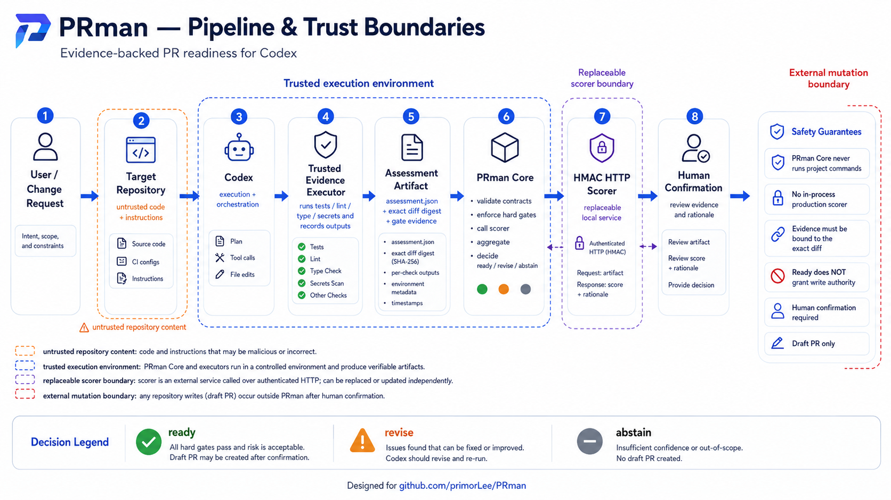

# PRman

PRman is a pre-alpha Codex-native framework for evidence-bound code-change assessments. Codex
performs the coding work; PRman supplies a reusable workflow, an optional scorer boundary, and
deterministic `ready / revise / abstain` aggregation. It is not a production PR gate.

PRman does **not** implement a second coding agent, candidate generator, worktree manager, command
sandbox, or GitHub client. Those responsibilities stay with Codex and its existing tools.



_Recommended production topology. The repository ships the PRman core and authenticated HTTP client,
not the pictured trusted evidence executor or production scorer service. Trusted in-process Python
scorers remain available only through explicit opt-in. See the
[visual asset status](docs/visual-assets.md) for what is live versus illustrative._

## Shape of the project

```text
Issue or current change
        |
        v
Codex: inspect, edit, run project commands, collect evidence
        |
        v
$prman skill: prepare a strict assessment
        |
        +--> optional scorer provider: six criterion probabilities
        |
        v
Deterministic core: hard gates + geometric score + uncertainty LCB
        |
        v
ready / revise / abstain
        |
        v
Human confirmation before any Draft PR write
```

The Skill is the workflow authoring format. The Plugin manifest makes that workflow installable and
shareable. This follows the official OpenAI documentation for
[building skills](https://learn.chatgpt.com/docs/build-skills) and
[building plugins](https://learn.chatgpt.com/docs/build-plugins).

## What is implemented

- Installable plugin manifest at `.codex-plugin/plugin.json`.
- Focused `prman` Skill with progressive assessment, scorer, and safety references.
- Strict JSON contracts for assessments, generated scorer requests, score bundles, and results.
- Shared repository, base-commit, and task bindings plus verification that each candidate ID hashes
  the supplied UTF-8 diff and each evidence record names that candidate.
- Optional HMAC evidence attestation bound to a decision-profile key ID; unattested evidence can
  never produce `ready`.
- Required evidence gates that cannot be overridden by a scorer.
- Six-dimensional weighted geometric aggregation with an absolute readiness LCB floor.
- Comparison rankings that exclude OOD, excessively uncertain, and truncated candidates.
- HMAC-authenticated loopback HTTP scoring with request nonces and signed provider identity.
- Explicitly trusted, in-process Python entry-point scorers for controlled development environments.
- Test-only fixture/static scorers that require an explicit CLI opt-in and always force the final
  selection to `abstain`.
- Exact scorer/model/calibrator binding in the decision profile and structured fail-closed scorer
  errors.
- Fixed output policy: human confirmation required, Draft-only, no external write authorized.

No scorer has been trained or downloaded. PRman itself does not create a GitHub issue, branch, or
pull request as part of an assessment.

## Development

PRman supports Python 3.11 and 3.12 and has no runtime dependencies. The distribution and installed
command are both named `prman-codex`, avoiding the unrelated existing PyPI `prman` package and CLI.

```bash
python3.11 -m venv .venv
. .venv/bin/activate
python -m pip install -e '.[dev]'
make check PYTHON=python
make demo PYTHON=python
```

The demo uses an explicitly marked fixture scorer, emits `"test_only": true`, and deliberately
returns `abstain`; a fixture can never issue a readiness claim.
For a fail-closed run without any scorer:

```bash
python skills/prman/scripts/assess.py \
  --input examples/assessment.json
```

That run returns `abstain` with `scorer_unavailable:not_configured` after the supplied hard gates
pass.

## Using the Skill

After installing the plugin through a supported Codex plugin source, invoke it explicitly:

```text
Use $prman to implement this issue, verify the change, and assess whether it is ready for a Draft PR.
```

Codex may also select the Skill implicitly when a request matches its description. During local
plugin development, follow the official [plugin usage guide](https://learn.chatgpt.com/docs/plugins).

The Skill prepares an assessment in temporary storage and calls its bundled helper. The helper
validates the supplied diff, evidence bindings, and (when configured) a trusted-executor HMAC. It
never runs project commands or modifies the target repository. A signature authenticates the
configured executor key; the executor still must truthfully observe commands.

## Scorer boundary

The preferred production boundary is a separately deployed scorer using `builtin.local-http` on a
numeric loopback address. Requests and responses are HMAC signed with a secret read from a named
environment variable, and responses bind the nonce, request digest, and exact provider metadata.

An external Python distribution may also register a factory under the `prman.scorers` entry-point
group, but that code executes with the full privileges of the PRman process. The CLI will not load it
without `--allow-trusted-python-scorer`; it is a trusted extension mechanism, not an isolation
boundary. Both provider forms implement `prman-scorer-plugin/1.1`.

Without a configured scorer, an exact matching `scorer_binding`, and a verified evidence attestation,
PRman abstains. The checked-in research profile intentionally binds neither a production scorer nor
an evidence-attestation key.
`builtin.static` and `builtin.fixture-json` are only for contract and smoke tests. See
[docs/scorer-protocol.md](docs/scorer-protocol.md).

## Safety meaning

`ready` means only that signed bound evidence, configured thresholds including the LCB floor, and an
exact scorer binding passed. It authenticates configured keys, not the truth or correctness of the
observations and model. A result is not a correctness proof, merge recommendation, or write
authorization. PRman requires an exact human confirmation before Codex uses an existing GitHub tool,
and only a Draft PR is in scope.

See [docs/architecture.md](docs/architecture.md),
[docs/threat-model.md](docs/threat-model.md), and
[docs/IMPLEMENTATION_STATUS.md](docs/IMPLEMENTATION_STATUS.md). Visuals and mockups are cataloged in
[docs/visual-assets.md](docs/visual-assets.md).

## Repository map

- `.codex-plugin/`: installable plugin metadata.
- `skills/prman/`: Codex workflow, references, and bundled helper.
- `src/prman/`: deterministic assessment library and scorer adapters.
- `configs/`: decision thresholds and scorer configuration examples.
- `docs/assets/`: public diagrams, brand references, and clearly separated mockups.
- `schemas/`: public JSON contracts.
- `examples/`: fixture-only smoke input and scorer output.
- `tests/core/`: unit, safety, distribution, CLI, and Skill-wrapper tests.

## License and repository

PRman is available under the [Apache License 2.0](LICENSE). The canonical repository is
[`primorLee/PRman`](https://github.com/primorLee/PRman).
